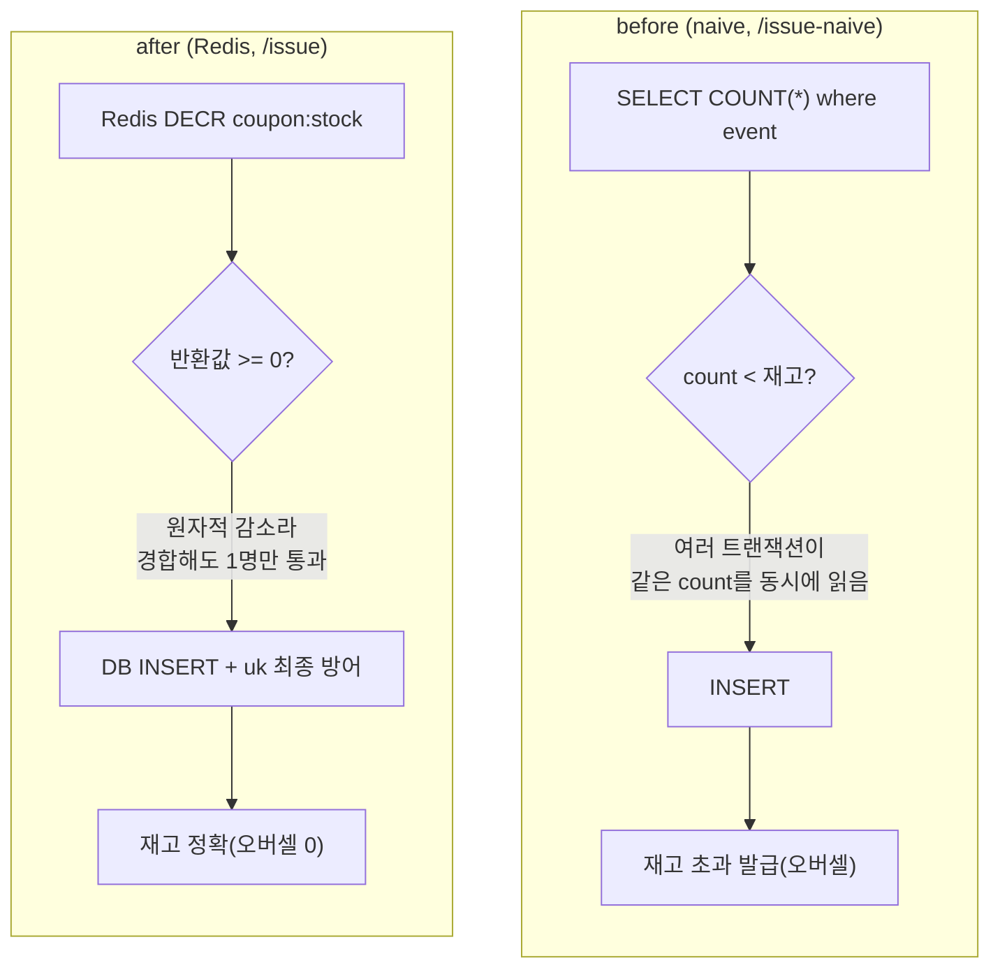

# 부하테스트 (k6)

선착순 쿠폰 발급의 **동시성 정합성과 처리량(TPS)** 을 개선 전(naive)/후(Redis)로 비교한다.

- 핵심 질문: 재고보다 많은 서로 다른 회원이 동시에 발급을 요청할 때 **재고를 정확히 지키는가(오버셀 0)**, 그리고 **얼마나 버티는가(TPS)**.
- 시나리오: `shared-iterations`로 총 `REQUESTS`건을 `VUS` 동시성으로 발사. 매 요청은 서로 다른 `memberId`(=`iterationInTest`)를 써서 재고를 초과하는 수의 회원이 경합하게 만든다.

## 개선 전/후 차이



- **before**: `SELECT COUNT -> INSERT` 사이 race window. 동시 트랜잭션이 같은 재고 스냅샷을 읽어 모두 통과 → 오버셀.
- **after**: Redis `DECR`이 원자적이라 동시 요청에서도 정확히 재고 수만큼만 통과. DB `uk_issued_coupons_event_member`가 최종 방어.

## 전제 조건

1. 인프라: Redis(6379), Kafka(9092), MySQL. (이 레포 docker-compose, 단 호스트 3306 점유 시 임시 포트 사용)
2. 회원 시드: 발급 INSERT는 `members` FK를 타므로 `memberId 1..MEMBER_COUNT` 회원 row가 DB에 있어야 한다. (벌크 INSERT)
3. 이벤트 1개 + Redis 재고 적재: `coupon:stock:{eventId}` = 재고.
4. 앱은 `loadtest` 프로파일로 기동(naive 엔드포인트 노출). JWT 서명 키(`jwt.secret`)는 k6 `JWT_SECRET`과 동일해야 한다.

## 실행

```bash
# 개선 전(naive)
docker run --rm --network host -v "$PWD/load-test:/scripts" grafana/k6 run \
  -e TARGET=naive -e EVENT_ID=1 -e STOCK=100000 \
  -e MEMBER_COUNT=200000 -e REQUESTS=200000 -e VUS=200 \
  /scripts/issue.js

# (재고/발급내역 리셋 후) 개선 후(Redis)
docker run --rm --network host -v "$PWD/load-test:/scripts" grafana/k6 run \
  -e TARGET=after -e EVENT_ID=1 -e STOCK=100000 \
  -e MEMBER_COUNT=200000 -e REQUESTS=200000 -e VUS=200 \
  /scripts/issue.js
```

주요 환경변수: `TARGET`(after|naive), `BASE_URL`, `EVENT_ID`, `MEMBER_COUNT`, `REQUESTS`, `VUS`, `JWT_SECRET`.

정합성 최종 확인(오버셀 여부)은 k6의 `issue_success`와 DB 실제 발급 수를 함께 본다:

```sql
SELECT COUNT(*) FROM issued_coupons WHERE event_id = 1;  -- 재고를 넘으면 오버셀
```

## 결과 (재고 100,000 / 요청 200,000 / VUS 200)

> 측정 환경: 단일 호스트(앱+MySQL+Redis+Kafka 동거), k6 도커, Hikari pool 50.
> 단일 박스라 절대 TPS보다 **개선 전/후 상대 비교**에 의미가 있다.

| 구분 | 발급 성공(200) | DB 실제 발급 | 오버셀 | 품절(409) | 에러 | 처리량(req/s) | p95 | p99 |
|------|----------------|--------------|--------|-----------|------|---------------|-----|-----|
| before (naive) | 100,049 | 100,049 | **+49** | 89,028 | 0 | 157 | 2.18s | 2.79s |
| after  (Redis) | 100,000 | 100,000 | **0** | 100,000 | 0 | **621** | **686ms** | 908ms |

- naive는 20분(maxDuration) cap에 걸려 189,077건만 처리(10,923건 미실행). after는 200,000건을 5분 22초에 완주.
- 오버셀 검증: 종료 후 `SELECT COUNT(*) FROM issued_coupons WHERE event_id=1` = naive 100,049(재고 초과), after 100,000(정확). after 종료 시 Redis `coupon:stock:1` = 0(정확히 소진).

### 해석

- **정합성**: after는 Redis `DECR`의 원자성 덕에 200 VU가 동시에 몰려도 정확히 재고 수만큼만 통과해 **오버셀 0**. naive는 `SELECT COUNT -> INSERT` 사이 race로 동시 트랜잭션들이 같은 재고 스냅샷을 읽어 **49건 초과 발급**. (오버셀 폭은 임계 시점의 동시성에 비례)
- **처리량**: after가 naive의 약 **4배**(621 vs 157 req/s), p95는 2.18s -> 686ms로 단축. naive는 요청마다 `issued_coupons` 전체 `COUNT(*)`가 테이블 증가에 비례해 느려지는 것이 병목. after는 O(1) Redis 연산으로 DB 부하를 1차 차단.
- **2중 방어**: after에서 동일 회원 중복 요청은 Redis `SISMEMBER`로 빠르게 거절(CP002)되고, 그래도 새어 나간 경합은 DB `uk_issued_coupons_event_member`가 최종 차단한다. 본 시나리오는 회원을 전부 다르게 배정해 중복(CP002)=0이며, 중복 거절 동작은 단위 테스트(CouponIssueServiceTest)로 별도 검증한다.
