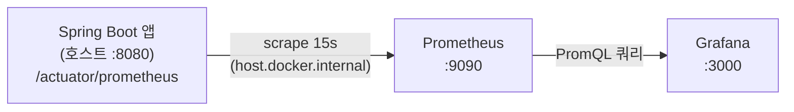

# 모니터링 (Prometheus + Grafana)

Spring Boot 앱의 메트릭을 Prometheus가 수집하고 Grafana가 시각화한다.

- **Micrometer**: 앱 내부 메트릭 파사드. `micrometer-registry-prometheus`가 Prometheus 포맷으로 `/actuator/prometheus`에 노출한다.
- **Prometheus**: pull 방식으로 15초마다 위 엔드포인트를 scrape, 자체 시계열 DB에 저장(PromQL 조회).
- **Grafana**: Prometheus를 데이터소스로 붙여 대시보드를 그린다.

## 흐름



> 앱은 도커 밖(IDE/호스트)에서 실행하므로, Prometheus 컨테이너는 `host.docker.internal:8080`(compose의 `host-gateway`)로 호스트의 앱을 scrape 한다.

## 기동

```bash
docker-compose up -d prometheus grafana
# 앱은 별도로(IDE/호스트) 기동: ./gradlew bootRun
```

| 컴포넌트 | 주소 | 비고 |
|----------|------|------|
| Prometheus | http://localhost:9090 | Status > Targets 에서 `couponrush-app` UP 확인 |
| Grafana | http://localhost:3000 | 기본 admin/admin (env로 변경 가능), 대시보드 "CouponRush Overview" 자동 로드 |
| 앱 메트릭 | http://localhost:8080/actuator/prometheus | Prometheus 포맷 원본 |

## 대시보드 패널 (코드 변경 없이 Micrometer 기본 메트릭만)

| 패널 | PromQL(요지) |
|------|--------------|
| HTTP 처리량 by uri | `sum by (uri) (rate(http_server_requests_seconds_count[1m]))` |
| HTTP p95 지연 by uri | `histogram_quantile(0.95, sum by (le, uri) (rate(http_server_requests_seconds_bucket[1m])))` |
| HTTP 상태코드 by status | `sum by (status) (rate(http_server_requests_seconds_count[1m]))` |
| JVM Heap 사용량 | `sum by (id) (jvm_memory_used_bytes{area="heap"})` |
| HikariCP 커넥션 | `hikaricp_connections_active / _idle / _pending` |
| JVM 스레드 / CPU | `jvm_threads_live_threads`, `system_cpu_usage` |

발급 API의 TPS/지연/상태코드(200·409) 분포는 `http_server_requests`로 보인다.
`load-test`의 k6 시나리오를 돌리면 대시보드에 트래픽이 차오르는 것을 확인할 수 있다.

## 트러블슈팅: Prometheus target이 DOWN(no route to host)

`host.docker.internal:8080`는 Docker Desktop(Mac/Windows)과 대부분의 Linux에서 동작한다. 단 방화벽이 빡빡한 Linux 호스트(예: OCI 기본 iptables)에서는 도커 브리지(172.17.0.1)에서 호스트 8080으로의 접근이 막혀 target이 DOWN(`no route to host`)일 수 있다. 해결책:

- (권장) 호스트 방화벽에서 도커 브리지 -> 호스트 8080을 허용한다. 예: `sudo iptables -I INPUT -i docker0 -p tcp --dport 8080 -j ACCEPT`
- 또는 앱을 컨테이너로 같은 compose 네트워크에 올려 `targets: ["<앱서비스명>:8080"]`로 scrape한다.
- 또는 prometheus를 `network_mode: host`로 띄우고 `targets: ["localhost:8080"]`로 scrape한다(Linux 전용).

앱이 `0.0.0.0:8080`에 바인딩돼 있고 호스트 네트워크 컨테이너에서는 정상 scrape됨을 확인했다(브리지 방화벽만 막힌 환경 이슈). datasource/대시보드 프로비저닝과 모든 패널 PromQL은 실제 앱 메트릭으로 검증 완료.

## 프로비저닝 구조

```
monitoring/
├── prometheus/prometheus.yml                 # scrape 설정
└── grafana/
    ├── provisioning/
    │   ├── datasources/datasource.yml        # Prometheus 데이터소스 자동 연결
    │   └── dashboards/dashboards.yml          # 대시보드 파일 provider
    └── dashboards/couponrush.json             # 대시보드 정의
```
