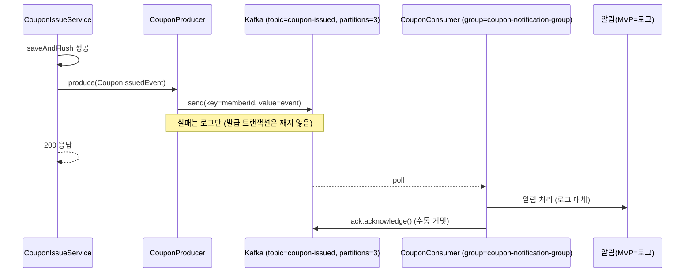

# Kafka produce/consume 흐름 (coupon-issued)

발급 트랜잭션이 DB `issued_coupons` INSERT까지 성공한 후 Kafka로 알림 발송을 비동기 위임한다.
토픽 `coupon-issued`, 파티션 3, key=memberId(파티션 내 순서 보장), at-least-once.

## 흐름

## 정합성 규칙

- **DB INSERT 성공 후에 produce**. 역순(produce -> INSERT) 금지. INSERT가 깨지면 알림이 먼저 나가버린다.
- key=`memberId`로 동일 회원 이벤트는 같은 파티션에 모인다(순서 보장).
- consumer는 `Acknowledgment.acknowledge()`로 수동 커밋한다(`spring.kafka.listener.ack-mode=manual`). 처리 중 장애 시 재배달(at-least-once).
- produce 실패는 MVP에서 로그만 남긴다. 발급 트랜잭션을 깨지 않기 위한 의도적 선택.

## MVP 한계 / 개선안

- produce 실패 시 메시지 손실 가능. 개선안은 Transactional Outbox 패턴(같은 트랜잭션에 outbox 테이블 INSERT, 별도 publisher가 폴링·전송)로 DB 커밋과 메시지 발행의 원자성을 확보하는 것.
- consumer 처리 실패 재시도 정책(Dead Letter Topic 등)도 MVP 범위 밖.
