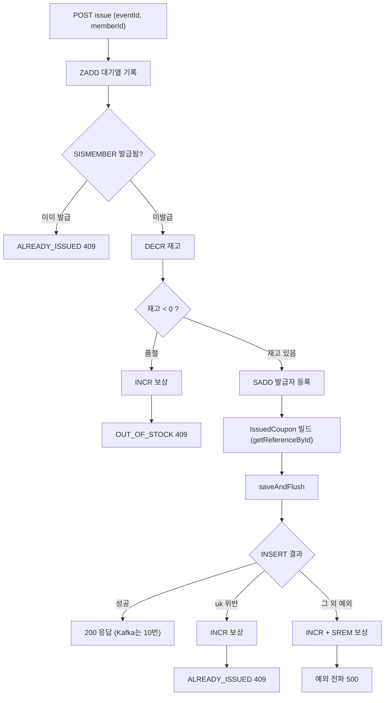

# 선착순 쿠폰 발급 흐름 (CouponIssueService)

`POST /api/coupons/{eventId}/issue` 요청 1건이 서비스 안에서 처리되는 순서다.
Redis로 1차 동시성 제어, DB `issued_coupons`가 최종 source of truth.
모든 if 분기 판단은 서비스(Java)에서 하고 Redis는 연산/반환만 담당한다.

## 흐름

## 정합성/보상 규칙

- 순서 엄수: ZADD 대기열 -> SISMEMBER 중복확인 -> DECR 재고 -> SADD 발급자 -> DB INSERT.
- `DECR`은 차감 후 값을 반환한다. 반환값이 음수면 품절이며, 깎은 만큼 `INCR`로 되돌려 값이 끝없이 음수로 drift 하는 것을 막는다.
- 정합성 2중 방어: Redis `SISMEMBER`(1차) + DB `uk_issued_coupons_event_member`(최종).
- `saveAndFlush`를 쓰는 이유: `save`만 하면 uk 위반이 트랜잭션 커밋 시점에 터져 메서드 안에서 잡을 수 없다. flush로 즉시 표면화시켜 보상 분기를 탄다.
- uk 위반(동시 중복 레이스): 재고만 `INCR` 복구하고 발급자 Set은 유지한다(실제로 발급된 상태라서). `ALREADY_ISSUED 409`.
- 그 외 INSERT 실패: 재고 `INCR` + 발급자 `SREM`까지 되돌려 재시도를 허용하고 예외를 전파한다.
- DB INSERT 성공 후에 Kafka produce(10번 작업). 역순 금지.

## MVP 한계 (README 개선안 후보)

- 대기열(ZADD)은 기록만 하고 MVP에서는 pop 하지 않는다(선착순 관측/순서 보장 근거).
- flush 이후 커밋 시점 실패는 보상 범위 밖이다. Redis/DB 최종 정합성 보정은 Transactional Outbox 등으로 개선 예정.
