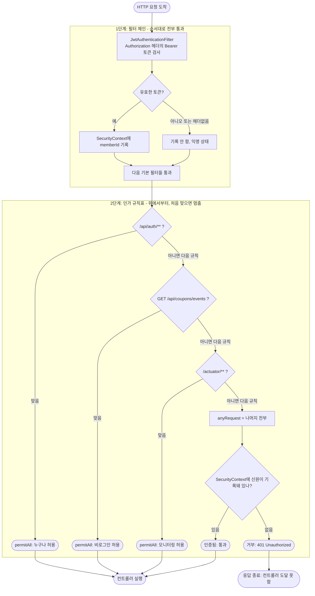

# SecurityConfig 보안 흐름

`SecurityConfig.securityFilterChain`이 정의하는 요청 처리 흐름을 정리한 문서다.
핵심은 **인증(누구인지 확인)** 과 **인가(출입 허가)** 가 서로 다른 단계에서 일어난다는 점이다.

## 전체 흐름



## 두 단계의 성격 차이

| | 1단계: 필터 체인 | 2단계: 인가 규칙표(authorizeHttpRequests) |
|--|--|--|
| 동작 | 위에서 아래로 **전부 통과** | 위에서부터 매칭하다 **처음 맞는 하나에서 멈춤** |
| 비유 | 컨베이어 벨트 | if / else if 사다리 |
| 역할 | 신원 확인(인증) | 출입 허가(인가) |
| 토큰 없으면 | 막지 않고 익명으로 통과 | anyRequest에 걸려 401 거부 |

1단계는 토큰을 까서 "누구인지"만 `SecurityContext`에 적어둔다. 막는 판단은 하지 않는다.
실제로 허용/거부를 결정하는 건 2단계다.

## 설정 한 줄씩

```java
.csrf(AbstractHttpConfigurer::disable)
```
CSRF 보호 끄기. JWT를 헤더에 직접 담는 방식이라 쿠키 기반 CSRF 공격이 성립하지 않는다. REST API + 토큰 인증의 표준 설정.

```java
.httpBasic(AbstractHttpConfigurer::disable)
.formLogin(AbstractHttpConfigurer::disable)
```
스프링 기본 로그인 방식(브라우저 팝업, 자동 생성 로그인 폼) 끄기. 직접 만든 `POST /api/auth/login`으로 JWT를 발급하므로 불필요하다.

```java
.sessionManagement(session -> session.sessionCreationPolicy(SessionCreationPolicy.STATELESS))
```
세션을 만들지 않는 무상태 모드. 서버가 상태를 기억하지 않고 요청마다 JWT로 신원을 증명한다. 서버 수평 확장에 유리하다.

```java
.authorizeHttpRequests(auth -> auth
        .requestMatchers("/api/auth/**").permitAll()
        .requestMatchers(HttpMethod.GET, "/api/coupons/events").permitAll()
        .requestMatchers("/actuator/**").permitAll()
        .anyRequest().authenticated())
```
URL별 접근 규칙. **위에서부터 처음 맞는 규칙 하나만 적용되고 멈춘다.** 그래서 구체적인 규칙을 먼저, 포괄 규칙(anyRequest)을 맨 마지막에 둔다. anyRequest를 위로 올리면 회원가입조차 토큰을 요구하게 된다.

```java
.exceptionHandling(handler -> handler.authenticationEntryPoint(new JwtAuthenticationEntryPoint(objectMapper)))
```
인가 단계에서 거부된 익명 요청을 어떻게 응답할지 지정한다. `formLogin`/`httpBasic`을 다 꺼서 기본 fallback이 403을 주므로, API 의미에 맞는 **401**과 공통 본문 `ApiResponse.error(UNAUTHORIZED)`(`C003`)를 돌려주도록 `JwtAuthenticationEntryPoint`를 명시한다.

```java
.addFilterBefore(new JwtAuthenticationFilter(jwtProvider),
        UsernamePasswordAuthenticationFilter.class);
```
우리 JWT 필터를 기본 인증 필터보다 앞에 끼운다. 그래야 인가 판단(2단계)에 도달하기 전에 토큰을 먼저 해석해 `SecurityContext`에 신원을 기록할 수 있다.

## 예시: POST /api/coupons/5/issue (토큰 없이 요청)

1. 필터 체인 통과: 토큰 없음 -> 익명 상태로 통과 (안 막음)
2. 인가 규칙표:
   - `/api/auth/**`? 아니오
   - `GET /api/coupons/events`? 아니오 (메서드도 URL도 다름)
   - `/actuator/**`? 아니오
   - `anyRequest()` -> 인증 필요 -> `SecurityContext` 비어 있음 -> **401 거부**
