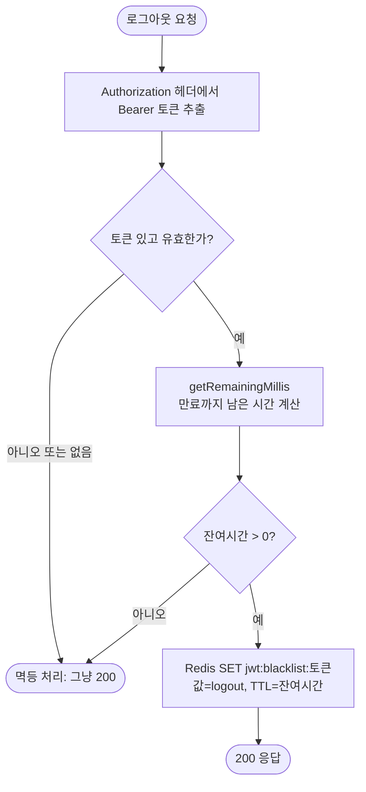
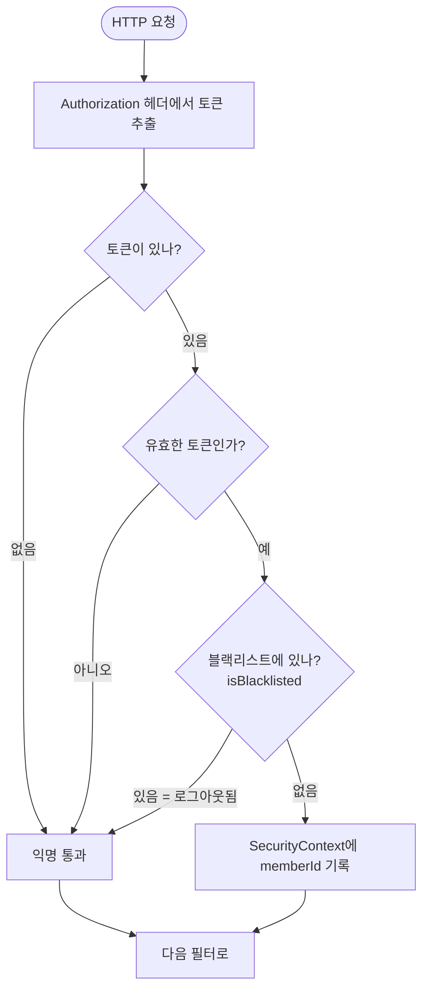
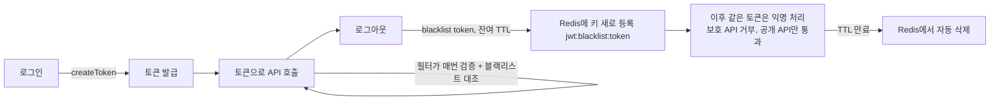

# JWT 인증과 로그아웃 블랙리스트

`global/jwt` 패키지 3개 클래스가 어떻게 맞물리는지 정리한 문서다.

| 클래스 | 역할 |
|--------|------|
| `JwtProvider` | 토큰 발급(createToken), 검증(validateToken), 정보 추출(getMemberId), 잔여 만료시간(getRemainingMillis) |
| `JwtAuthenticationFilter` | 매 요청마다 토큰을 까서 신원을 SecurityContext에 기록 |
| `TokenBlacklistRepository` | 로그아웃된 토큰을 Redis에 저장(TTL=잔여시간) / 조회 |

## 왜 블랙리스트가 필요한가

JWT는 stateless라 한번 발급하면 토큰 안에 박힌 **만료시각(exp) 전까지 서버가 막을 방법이 없다.** 1시에 로그인해 "2시까지 유효" 토큰을 받았다면, 1시 30분에 로그아웃해도 그 토큰은 여전히 2시까지 통과된다. 누가 그 토큰을 그대로 다시 쓰면 들어와진다.

핵심: **로그아웃해도 JWT 자체는 죽지 않는다.** 서명도 멀쩡하고 만료도 안 됐으니 `validateToken`은 계속 `true`를 준다. 그래서 "이 토큰은 죽은 것으로 친다"는 **별도 표시를 Redis에 남기고**, 필터가 매 요청마다 그 표시를 대조한다.

그 표시의 수명(TTL)은 **토큰 잔여 만료시간**으로 준다. 토큰은 어차피 2시면 스스로 만료돼 거부되니, 블랙리스트 표시도 2시에 같이 사라지면 된다. 그래야 Redis에 쓸모없는 데이터가 쌓이지 않는다.

## 로그아웃 흐름: POST /api/auth/logout



무효하거나 없는 토큰은 어차피 못 쓰는 토큰이라 막을 것도 없으니 그냥 성공으로 처리한다(멱등).

### Redis에 "변경"이 아니라 "새로 등록"

로그아웃 전에는 그 토큰에 해당하는 Redis 키가 **아예 없다.** 로그아웃하면서 `jwt:blacklist:{토큰}` 키를 **새로 만들고** 값으로 `logout`을 넣는다. 그래서 필터는 "값이 뭐냐"가 아니라 **"이 키가 존재하냐(`isBlacklisted`)"** 만 본다. 키가 있으면 죽은 토큰, 없으면 산 토큰. 값 `logout`은 의미 없는 표식일 뿐이다.

### 왜 TTL을 잔여시간으로 주는가 (영화표 비유)

표는 6시까지 유효한데 5시에 "이 표 취소"라고 검표원에게 메모를 준다고 하자. 그 메모는 **6시까지만** 의미 있다. 6시가 지나면 표 자체가 만료라 메모가 없어도 어차피 입장 거부된다. 그래서 메모 수명은 "6시까지 남은 1시간"이면 충분하다.

토큰도 똑같다. 블랙리스트 표시는 토큰 만료시점까지만 필요하므로 TTL = 잔여 만료시간으로 준다.

### 왜 `잔여시간 > 0` 을 또 확인하는가

방어 장치다. 두 가지를 막는다.

1. **이미 만료 직전/직후인 토큰**: 검증을 통과한 직후(`validateToken`==true) 잔여시간을 계산하는 그 찰나에 토큰이 만료될 수 있다(몇 ms 차이, 시계 오차). 이미 죽은 토큰은 어차피 `validateToken`이 거부하니 블랙리스트에 넣을 이유가 없다.
2. **Redis가 음수/0 TTL을 거부함**: TTL은 양수여야 한다. 잔여시간이 음수인 채로 등록을 시도하면 예외가 난다. `> 0` 체크가 그 비정상 호출을 막는다.

## 이후 모든 요청: 인증 필터의 블랙리스트 대조



필터의 인증 조건은 코드 한 줄로 표현된다:

```java
if (token != null
        && jwtProvider.validateToken(token)
        && !tokenBlacklistRepository.isBlacklisted(token)) {
    // 신원 기록
}
```

세 조건이 모두 참일 때만 인증된 사용자로 취급한다. 블랙리스트에 있으면(로그아웃된 토큰이면) 익명 상태로 통과시킨다.

### "익명 통과"는 상태이지 거부가 아니다

여기서 "익명"은 **신원이 SecurityContext에 없는 상태**를 뜻한다. 응답 코드가 아니다. 막느냐 마느냐는 **다음 인가 단계**에서 결정된다 (SecurityConfig.md의 2단계 구조).

- 익명 = `permitAll` 엔드포인트만 쓸 수 있는 상태. (`/api/auth/**`, `GET /api/coupons/events`, `/actuator/**`)
- 로그아웃한 토큰으로 **인증 필요한** 엔드포인트(예: `/api/coupons/my`)를 치면 인가 단계에서 거부된다.
- 같은 토큰으로 **공개(permitAll)** 엔드포인트를 치면 익명으로 그냥 200 통과한다.

즉 "익명 = 무조건 401"이 아니다. 보호된 엔드포인트일 때만 거부된다.

> 주의: 거부 시 실제 응답 코드가 401인지 403인지는 아직 검증하지 않았다. 현재 설정은 `formLogin`/`httpBasic`을 모두 껐고 별도 `AuthenticationEntryPoint`를 지정하지 않아 Spring Security 기본 fallback이 403을 줄 가능성이 있다. API 의미상 401이 맞으므로, 추후 401 반환 entry point를 명시하고 이 문구를 사실에 맞게 갱신할 것. (미확정)

## 발급부터 로그아웃까지 전체 생애주기



## 정합성 메모

- 블랙리스트 키: `jwt:blacklist:{token}`, 값은 의미 없는 표식(`logout`), 만료는 TTL이 담당.
- Redis 접근은 `TokenBlacklistRepository`로만. `AuthService`/`JwtAuthenticationFilter`는 `StringRedisTemplate`을 직접 모른다 (CouponRedisRepository와 같은 캡슐화 원칙).
- 로그아웃은 멱등하다. 같은 토큰을 여러 번 로그아웃해도 결과는 동일하다.
